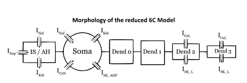

# Bifurcation-analysis-of-spinal-motoneuron-firing-behaviour

### Authors:  
Muhammad Mustafa 1* , Mohamed H. Mousa 2* , Mohamed S. Saad 3 , Tamer Basha 1 , and Sherif M.Elbasiouny 2,4
### Affiliation:  
1. Department of Systems and Biomedical Engineering, Faculty of Engineering, Cairo University, Giza, Postal code: 12316, Egypt
2. Department of Biomedical, Industrial and Human Factors Engineering, College of
Engineering and Computer Science, Wright State University, Dayton, Ohio, 45435, USA
3. Department of Electrical Power and Machines, Faculty of Engineering, Cairo University,
Giza, Postal code: 12316, Egypt,
4. Department of Neuroscience, Cell Biology, and Physiology, Boonshoft School of Medicine
and College of Science and Mathematics, Wright State University, Dayton, Ohio, 45435,
USA

### Email:  
[muhammadmoustafa@eng1.cu.edu.eg](muhammadmoustafa@eng1.cu.edu.eg), [mohamed.mousa@wright.edu](mohamed.mousa@wright.edu), [mssaad@gmail.com](mssaad@gmail.com), [tamer.basha@gmail.com](tamer.basha@gmail.com), [sherif.elbasiouny@wright.edu](sherif.elbasiouny@wright.edu)

---

## Significance

  
6c Reduced Model Morphology

We developed the first, to our knowledge, multi-compartment computer model of a neuron in XPPAUT, the primary bifurcation analysis software used in the literature, and conducted bifurcation analysis with unprecedented anatomical and ion channel detail, under normal and disease conditions. Using this model, we conducted bifurcation analysis of the role somatic and dendritic ion channels play in regulating repetitive firing of spinal motoneurons. We report novel nonlinear bifurcation behaviors of motoneurons under normal conditions and describe their underlying mechanisms. We also examined how known anatomical abnormalities of ALS contribute to motoneuron excitability dysfunction. The novel multi-compartment XPPAUT model, which we make publicly available to the scientific community, expands our capabilities to study neuronal function under normal and disease conditions.

---

## Requirements and Installation
- In order to run the model, You need to have some familiarity with XPPAUT.
- For XPPAUT installation please refer to [Link](http://www.math.pitt.edu/~bard/xpp/xpp.html) 

---

## File List

| File | Function |
| --- | --- |
| main.ode | model starting point |
| ah.inc, and all ah files | Axon hilloc compartment and its channels |
| soma.inc and dendrites files | same as ah |
| conn.inc | the connection eqaution "**conductance and resistance**" between each two compartments |
| func.inc | contains helper functions |
| glob.inc | constants used in the model |
| opt.inc | options used in xppaut |
| stim.inc | stimulation current equation |

---

## Steps
1. Open main.ode using XPPAUT 
2. Run time simulation till reaching steady state, usually running for till 600ms is enough
3. Open Auto and run steady state
4. Grab one of the two hopf bifurcation points and run periodic

---
## ALS Changes:

This section provides the necessary steps to implement some of the ALS cellular changes.

**Note**: All ODEs describing the model are per unit area.

- Soma Enlargement:
  -  Multiply the soma dimaeter by the change ratio in soma.inc file.
- Ion Conductance
	To change any ion channel conductance:
	1. Locate the compartment inc file.
	2. Multiply the conductance by the change ratio.  
  *For example:* To increase the Na conductance in axon hillock, increase the na conductance in ah.inc
	
- Adding new compartment:
	1. Add a new file and write the ODEs of this compartment, you can follow the same style of any compartment inc file.
	2. Include the new file in main.ode file.
	3. Add the mutual resistance and conductance in conn.inc file.
	4. Modify the current equation in the affected compartment using the conductances defined in conn.inc file.

